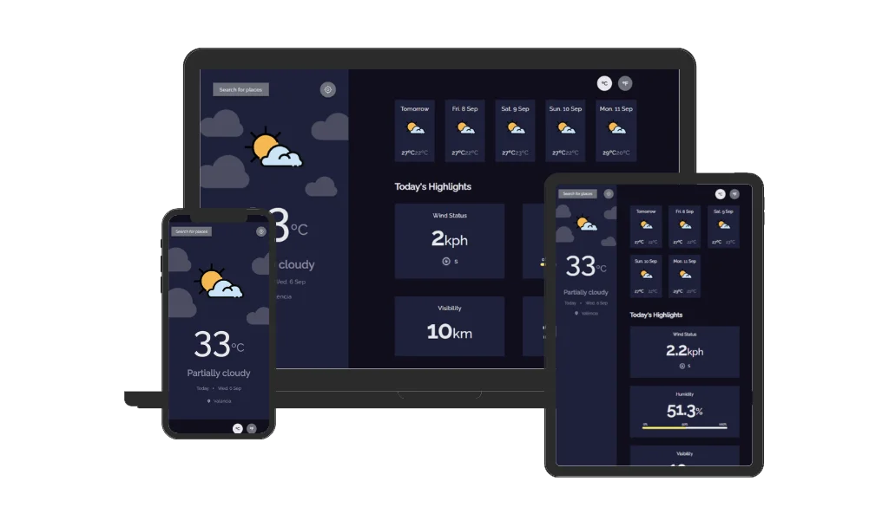

 <div align="center" valign="center">
  <h1 valign="center"> 
    
    Weather App
    
  </h1> 
  Solution for a challenge from  <a href="https://devchallenges.io/challenges/mM1UIenRhK808W8qmLWv" target="_blank">devchallenges.io</a>. Coded with ♥ by Pedro Ramos
  <br><br>

  [](https://es.react.dev/)
  [](https://vitejs.dev/)
  [](https://sass-lang.com/)

</div>
<br>

## Preview




## Installation

<!-- Example: -->

To clone and run this application, you'll need [Git](https://git-scm.com) and [Node.js](https://nodejs.org/en/download/) (which comes with [npm](http://npmjs.com)) installed on your computer. From your command line:

```bash
# Clone this repository
$ git clone https://github.com/pedrorxmos/weather-app-challenge.git

# Install dependencies
$ npm install

# Run the app
$ npm start
```

## Deployment

To deploy this applicattion, you have to use:

```bash
$ npm run build
```

## My Links
- Portfolio: [pedrorxmos.com](https://pedrorxmos.com)
- Github: [@pedrorxmos](https://github.com/pedrorxmos)
- LinkedIn: [@pedroramosguardiola](https://linkedin.com/in/pedroramosguardiola)
- Twitter: [@pedrorxmos](https://twitter.com/pedrorxmos)
- Mail: [pedrorxmosdev@gmail.com](mailTo:pedrorxmosdev@gmail.com)